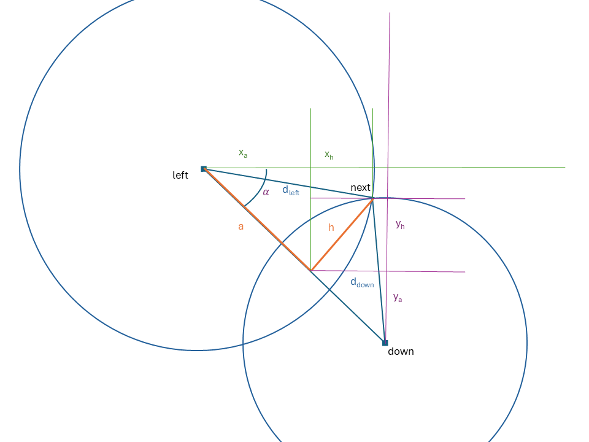

```{r}
#| label: DoNotModify
#| include: false
### Utilities. Do not modify.
# Installation of packages if necessary
InstallPackages <- function(Packages) {
  InstallPackage <- function(Package) {
    if (!Package %in% installed.packages()[, 1]) {
      install.packages(Package, repos = "https://cran.rstudio.com/")
    }
  }
  invisible(sapply(Packages, InstallPackage))
}

# Basic packages
InstallPackages(c("bookdown", "formatR", "kableExtra", "ragg"))

# Chunk font size hook: allows size='small' or any valid Latex font size in chunk options
def.chunk.hook  <- knitr::knit_hooks$get("chunk")
knitr::knit_hooks$set(chunk = function(x, options) {
  x <- def.chunk.hook(x, options)
  ifelse(options$size != "normalsize", paste0("\n \\", options$size,"\n\n", x, "\n\n \\normalsize"), x)
})
```

```{r Options}
#| include: false
### Customized options for this document
# Add necessary packages here
Packages <- c("tidyverse", "ggspatial", "readxl", "sf", "terra")
# Install them
InstallPackages(Packages)

# knitr options
knitr::opts_chunk$set(
  cache =   FALSE,    # Cache chunk results
  include = TRUE,     # Show/Hide chunks
  echo =    TRUE,     # Show/Hide code
  warning = FALSE,    # Show/Hide warnings
  message = FALSE,    # Show/Hide messages
  # Figure alignment and size
  fig.align = 'center', out.width = '80%',
  # Graphic devices (ragg_png is better than standard png)
  dev = c("ragg_png", "pdf"),
  # Code chunk format
  tidy = FALSE, tidy.opts = list(blank = FALSE, width.cutoff = 50),
  size = "scriptsize", knitr.graphics.auto_pdf = TRUE
  )
options(width = 50)

# ggplot style
library("tidyverse")
theme_set(theme_bw())
theme_update(
  panel.background = element_rect(fill = "transparent", colour = NA),
  plot.background = element_rect(fill = "transparent", colour = NA)
)
knitr::opts_chunk$set(dev.args = list(bg = "transparent"))

# Random seed
set.seed(973)
```

# Problème à traiter

Les petits arbres de 9 hectares de la parcelle 16 de Paracou sont localisés sur le terrain dans des quadrats de 10m sur 10m, eux-mêmes regroupés dans des sous-parcelles d'un hectare dont la position des sommets (nommés B.1 à B.13) est connue très précisément grâce à un relevé de géomètre.

```{r}
library("tidyverse")

# Paracou 16 shapefile
library("terra")
library("sf")
vect("data/Plot16.shp") %>% 
  st_as_sf() -> paracou_16

# Surveyor's points
library("readxl")
read_xlsx("data/plots.xlsx", sheet = "surveyor") %>% 
  as.data.frame() -> surveyor
surveyor %>% 
  st_as_sf(coords = c("x_utm","y_utm")) %>% 
  st_set_crs(crs(paracou_16)) -> surveyor.sf

# Map
library("ggspatial")
ggplot() +
  geom_sf(data = st_cast(paracou_16)) +
  geom_sf_text(data = surveyor.sf, aes(label = point), col = "red") +
  ggtitle("Paracou P16 9ha - Surveyor's points") +
  annotation_scale(location = "br") +
  annotation_north_arrow(
    pad_y = unit(1, "cm"),
    style = north_arrow_nautical()
  )
```

Les sous-parcelles ("subplots") sont définies par leurs quatre coins (haut-gauche, haut-droit, bas-droit, et bas-gauche qui est l'origine du repère local) et numérotées.

```{r}
read_xlsx("data/plots.xlsx", sheet = "subplots") %>% 
  as.data.frame() -> subplots
# Example
subplots[1:3, ]
```

Les quadrats de 10m sont marqués par des piquets.
Leur position est approximative (la progression et les mesures d'angle et de distance en sous-bois sont difficiles) mais les distances entre chaque piquet et ses voisins ont été remesurées précisément au laser.

Enfin, les arbres ont été positionnés dans les quadrats à partir de leur distance aux bords, avec une certaine incertitude.

L'objectif est de replacer le plus précisément possible les arbres dans les sous-parcelles pour obtenir leurs coordonnées dans le référentiel standard local, UTM zone 26N.

# Méthode

Dans un premier temps, les quadrats seront repositionnés à l'intérieur des sous-parcelles, les arbres seront ensuite repositionnés dans chaque quadrat.
Pour cela:

1. Les coordonnées des sous-parcelles doivent être transformées en coordonnées locales, dont l'origine est le coin inférieur gauche de chacune d'elles.
2. Les quadrats doivent être repositionnés dans chaque sous-parcelle, sur la base des hypothèses suivantes:
    - les limites basse et gauche des sous-parcelles parcourues sur le terrain pour y placer les quadrats sont rectilignes,
    - elles ne sont pas forcément orthogonales: l'angle précis de la base du repère est donné par les mesures du géomètre,
    - les distances mesurées au laser sont exactes, ce qui permet de calculer de proche en proche la position des points constituant les quadrats par triangulation, à partir de l'origine du repère de la sous-parcelle,
3. les points obtenus sont replacés dans les limites précises de chaque sous-parcelle par interpolation,
4. enfin, les arbres sont repositionnés dans les limites précises de chaque quadrat par interpolation.


# Coordonnées locales des sous-parcelles

Les sous-parcelles doivent être projetées dans leur système de coordonnées locales: le point en bas à gauche est l'origine du repère.

Le passage des coordonnées locales aux coordonnées UTM est un changement de base (selon les coordonnées des vecteurs unitaires en UTM) suivie d'une translation (selon la position du point d'origine de la sous-parcelle).

## Rotation

La matrice de changement de base (des coordonnées locales aux coordonnées UTM) est calculée par la fonction suivante:

```{r}
local2utm <- function(subplot, surveyor, subplots) {
  # Find the points
  is_origin <- (surveyor$point == subplots[subplots$subplot == subplot, "down_left"])
  is_down_right <- (surveyor$point == subplots[subplots$subplot == subplot, "down_right"])
  is_up_left <- (surveyor$point == subplots[subplots$subplot == subplot, "up_left"])
  
  # X-axis vector
  i_dx_utm <- surveyor[is_down_right, "x_utm"] - surveyor[is_origin, "x_utm"]
  i_dy_utm <- surveyor[is_down_right, "y_utm"] - surveyor[is_origin, "y_utm"]
  i_length <- sqrt(i_dx_utm^2 + i_dy_utm^2)
  # Unit vector
  i <- c(i_dx_utm, i_dy_utm) / i_length
  
  # Y-axis vector
  j_dx_utm <- surveyor[is_up_left, "x_utm"] - surveyor[is_origin, "x_utm"]
  j_dy_utm <- surveyor[is_up_left, "y_utm"] - surveyor[is_origin, "y_utm"]
  j_length <- sqrt(j_dx_utm^2 + j_dy_utm^2)
  # Unit vector
  j <- c(j_dx_utm, j_dy_utm) / j_length

  return(cbind(i, j))
}

# Test the function: transition matrix of subplot 13
local2utm(13, surveyor, subplots)
```

Le passage des coordonnées UTM aux coordonnées locales utilise la matrice inverse:

```{r}
# local coordinates of subplot 13, expected to be (100, 0)
local2utm(13, surveyor, subplots) %>%
  # UTM to local
  solve() %*%
  # UTM vector X
  c(
    surveyor[surveyor$point == "B.7", "x_utm"] - 
      surveyor[surveyor$point == "B.6", "x_utm"],
    surveyor[surveyor$point == "B.7", "y_utm"] - 
      surveyor[surveyor$point == "B.6", "y_utm"]
  )
```
## Coordonnées locales

 Les coordonnées locales des sommets des sous-parcelles sont calculées:
 
```{r}
# Get the UTM coordinates of the points
subplots %>% 
  # add coordinates of point up_left
  left_join(surveyor, by = join_by("up_left" == "point")) %>% 
  # delete the altitude
  select(-z_utm) %>% 
  # rename the columns accoding to the chosen point
  rename(up_left_x_utm = x_utm, up_left_y_utm = y_utm) %>% 
  # repeat all three steps for up_right
  left_join(surveyor, by = join_by("up_right" == "point")) %>% 
  select(-z_utm) %>% 
  rename(up_right_x_utm = x_utm, up_right_y_utm = y_utm) %>% 
  # repeat all three steps for down_right
  left_join(surveyor, by = join_by("down_right" == "point")) %>% 
  select(-z_utm) %>% 
  rename(down_right_x_utm = x_utm, down_right_y_utm = y_utm) %>% 
  # repeat all three steps for down_left
  left_join(surveyor, by = join_by("down_left" == "point")) %>% 
  select(-z_utm) %>% 
  rename(down_left_x_utm = x_utm, down_left_y_utm = y_utm) ->
  subplots

# Prepare the columns
subplots %>% 
  mutate(
    # Local coordinates before interpolation
    up_left_x_field = NA, up_left_y_field = NA, 
    up_right_x_field = NA, up_right_y_field = NA, 
    down_right_x_field = NA, down_right_y_field = NA, 
    down_left_x_field = NA, down_left_y_field = NA
  ) -> subplots

# Get the coordinates
for (i in seq_len(nrow(subplots))) {
  subplot <- subplots$subplot[i]
  # Transition matrix
  utm2local <- solve(local2utm(subplot, surveyor, subplots))
  # Relative UTM coordinates
  # substract the coordinates of the origin to that of all points 
  # to get relative coordinates
  # do.call transforms the obtained list into a vector
  do.call('c', subplots[i, 6:13] - rep(subplots[i, 12:13], 4)) %>% 
    # Make a matrix, columns are realtive X and Y
    matrix(nrow = 4, ncol = 2, byrow = TRUE) -> utm_relative
  # Multiply by the transition matrix
  utm2local %*% t(utm_relative) %>% 
    # Make a vector and save it into subplots
    as.vector() ->
    subplots[i, 14:21]
}
```
 
L'orthogonalité entre abscisse et ordonnée des sous-parcelles est vérifiée par la nullité du produit scalaire des vecteurs constitués par les bordures bas et gauche des sous-parcelles.

```{r}
subplots %>% 
  mutate(scal_prod = up_left_x_field * down_left_x_field + up_left_y_field * down_right_y_field) %>% 
  select(subplot, scal_prod)
```

# Position des quadrats

## Fonction de triangulation

On connaît la position des points à gauche $(x_{left}, y_{left})$ et en dessous $(x_{down}, y_{down})$ du point à placer (à l'intersection des deux cercles), ainsi que les distances entre eux et le point à placer: $d_{left}$ et $d_{down}$.
Par construction de l'algorithme, le point à placer est situé au dessus et à droite des points précédents.

```{r, echo=FALSE, out.width="100%"}

```

Par le théorème de Pythagore, on connaît:

- la distance entre les points de gauche et du bas:
$$d =  \sqrt{(x_{left} - x_{down})^2 + (y_{left} -y_{down})^2},$$
- et deux équations reliant $a$ et $h$
\begin{align}
a^2 + h^2 &= d_{left}^2,\\
(d - a)^2 + h^2 &= d_{down}^2.
\end{align}


La première équation du système permet d'isoler $h$:
$$h^2 = d_{left}^2 - a^2.$$
En substituant $h^2$ dans la deuxième équation
$$(d - a)^2 + d_{left}^2 - a^2= d_{down}^2,$$
d'où
$$a = \frac{d^2 + d_{left}^2 - d_{down}^2}{2d}$$
et
$$h = \sqrt{d_{left}^2 - a^2}.$$

Les distances entre les points précédents et le point suivant sont calculées en projetant $a$ et $h$ sur les axes du repère. 
Pour cela, l'angle $\alpha$ est calculé:
$$\alpha = \arctan{\frac{x_{down} - x_{left}}{y_{left} - y_{down}}}.$$

Il reste à projeter:

\begin{equation} 
\begin{split}
d_{left} & = x_a + x_h\\
 & = a \sin\alpha + h \cos\alpha
\end{split}
\end{equation}

et 

\begin{equation} 
\begin{split}
d_{down} & = y_a + y_h\\
 & = (d - a) \sin{(\frac{\pi}{2} - \alpha)} + h \sin\alpha.
\end{split}
\end{equation}

La fonction `next_point()` calcule les coordonnées du point suivant:
```{r}
# Triangulation
next_point <- function(
    x_left,
    y_left,
    x_down,
    y_down,
    d_left,
    d_down) {
  # distance left-down
  d_squared <- (x_left - x_down)^2 + (y_left - y_down)^2
  d <- sqrt(d_squared)
  # distance left-height
  a <- (d_squared + d_left^2 - d_down^2) / 2 / d
  # height
  h <- sqrt(d_left^2 - a^2)
  # angle
  alpha <- atan((x_down - x_left) / (y_left - y_down))
  # next point
  d_left_a <- a * sin(alpha)
  d_left_h <- h * cos(alpha)
  d_down_a <- (d - a) * sin(pi / 2 - alpha)
  d_down_h <- h * sin(alpha)
  return(c(d_left_a + d_left_h, d_down_a + d_left_h))
}
```

Test de la fonction:
```{r}
# Test the function
x_left <- 0
y_left <- 10
x_down <- 10
y_down <- 0
d_left <- 11
d_down <- 10
next_point(x_left, y_left, x_down, y_down, d_left, d_down) 
```


## Placement des quadrats

Le tableau des mesures contient trois colonnes pour décrire la position des angles des quadrats: `plot` pour l'hectare, `point_x` et `point_y` pour le numéro du point, de (0, 0) pour le coin inférieur gauche à (10, 10) pour le coin supérieur droit.

Pour chaque point, la distance à son voisin de gauche (`y` identique) et du bas (`x` identique), mesurées sur le terrain, sont dans les colonnes `d_left` et `d_down`.

Le code suivant:

- lit le tableau des mesures et prépare deux colonnes supplémentaires, `x` et `y`, pour y placer les coordonnées à calculer,

```{r}
# data
read_xlsx("data/plots.xlsx", sheet = "quadrats") %>% 
  # Add columns for the correct coordinates
  mutate(x = 0, y = 0) -> quadrats
```

- ajoute les coins inférieurs gauche (0, 0),

```{r}
# Add points (0,0) to plots
for (subplot_number in unique(quadrats$subplot)) {
  quadrats %>% 
    add_row(
      subplot = subplot_number,
      point_x = 0,
      point_y = 0,
      x = 0,
      y = 0
    ) -> quadrats
}
```

- trie les données et transforme le tibble en dataframe pour que les extractions futures, comme `quadrats[i, "x"]`, soient des scalaires et non des tibbles,

```{r}
# Sort so that the next point can rely on previous ones
quadrats %>% 
  arrange(subplot, point_x, point_y) %>% 
  as.data.frame() -> quadrats
```

- calcule les coordonnées des points situés sur les bords gauche et bas des hectares par simple cumul des distances mesurées depuis l'origine,

```{r}
# Deal with edges: cumulative sum of distances from the origin
for (plot_number in unique(quadrats$subplot)) {
  is_left_edge <- 
    quadrats$subplot == plot_number &
    quadrats$point_x == 0 &
    quadrats$point_y != 0
  quadrats[is_left_edge, "y"] <- cumsum(
    quadrats[is_left_edge, "d_down"]
  )
  is_down_edge <- 
    quadrats$subplot == plot_number &
    quadrats$point_x != 0 &
    quadrats$point_y == 0
  quadrats[is_down_edge, "x"] <- cumsum(
    quadrats[is_down_edge, "d_left"]
  )
}
```

- calcule les coordonnées de tous les autres points par triangulation.

```{r}
# Compute the positions of the points
for (i in seq_len(nrow(quadrats))) {
  # Ignore the edges
  if (quadrats[i, "point_x"] != 0 & quadrats[i, "point_y"] != 0) {
    x_left = quadrats[
      quadrats$subplot == quadrats[i, "subplot"] &
        quadrats$point_x == max(quadrats[i, "point_x"] - 1, 0) &
        quadrats$point_y == quadrats[i, "point_y"],
      "x"
    ]
    y_left = quadrats[
      quadrats$subplot == quadrats[i, "subplot"] &
        quadrats$point_x == max(quadrats[i, "point_x"] - 1, 0) &
        quadrats$point_y == quadrats[i, "point_y"],
      "y"
    ]
    x_down = quadrats[
      quadrats$subplot == quadrats[i, "subplot"] &
        quadrats$point_x == quadrats[i, "point_x"] &
        quadrats$point_y == max(quadrats[i, "point_y"] - 1, 0),
      "x"
    ]
    y_down = quadrats[
      quadrats$subplot == quadrats[i, "subplot"] &
        quadrats$point_x == quadrats[i, "point_x"] &
        quadrats$point_y == max(quadrats[i, "point_y"] - 1, 0),
      "y"
    ]
    quadrats[i, c("x", "y")] <- 
      c(x_left, y_down) +
      next_point(
        x_left = x_left,
        y_left = y_left,
        x_down = x_down,
        y_down = y_down,
        d_left = quadrats[i, "d_left"],
        d_down = quadrats[i, "d_down"]
      )
  }
}
```

Le dataframe `quadrats` contient maintenant la position des quadrats.

Figure:

```{r}
quadrats %>% 
  ggplot(aes(x = x, y = y, color = as.factor(subplot))) +
  geom_point() +
  scale_color_discrete() +
  scale_x_continuous(breaks = (0:10) * 10) +
  scale_y_continuous(breaks = (0:10) * 10) +
  coord_fixed() +
  theme(axis.text.x = element_text(angle = 90)) +
  labs(color = "subplot") +
  facet_wrap(~ subplot, nrow = 2)
```

## Interpolation

Les piquets des quadrats doivent être repositionnés pour que la forme de chaque sous-parcelle issue du terrain corresponde à sa forme réelle, issue des mesures du géomètre, qui n'est pas exactement un carré. 
Cette opération ne sert qu'à réconcilier les limites de la sous-parcelle sur le terrain (considérée comme un carré) et les données du géomètre.

Les coordonnées des points doivent être interpolées pour que la valeur maximale de l'abscisse, pour une ordonnée donnée, corresponde aux mesures du géomètre.
Le raisonnement est le même pour les ordonnées.

```{r, echo=FALSE, out.width="100%"}
knitr::include_graphics("images/interpolation.png")
```
A condition que les limites du bas et de gauche de la sous-parcelle soient orthogonales, la valeur maximale de l'abscisse x, qui dépend de y, est donnée par
$$x_{max} = x_{down,right} + y \times
  \frac{x_{up,right} - x_{down,right}}{y_{up,right} - y_{down,right}}.$$

De même,
$$y_{max} = y_{up,left} + x \times
  \frac{y_{up,right} - y_{up,left}}{x_{up,right} - x_{up,left}}.$$

Les coordonnées interpolées sont
$$x = x_0 + \frac{x_{max}}{x_M}$$
et
$$y = y_0 + \frac{y_{max}}{y_M}$$
où $(x_0, y_0)$ sont les coordonnées du point avant interpolation et $x_M$ et $y_M$ les valeurs maximales assumées pendant les mesures de terrain, ici 100 mètres.


Application aux quadrats:

```{r}
# Theoretical subplot size
x_M <- 100
y_M <- 100
quadrats %>% 
  # Rename raw x and y columns
  rename(x_0 = x, y_0 = y) %>% 
  # Join the subplot coordinates
  left_join(subplots) %>% 
  mutate(
    x = x_0 * (
      down_right_x_field + 
        y_0 * (up_right_x_field - down_right_x_field) / 
        (up_right_y_field - down_right_y_field)
      ) / x_M,
    y = y_0 * (
      up_left_y_field + 
        y_0 * (up_right_y_field - up_left_y_field) / 
        (up_right_x_field - up_left_x_field)
      ) / y_M,
  ) -> quadrats
```

Les coordonnées UTM des quadrats sont recalculées:

```{r}
# Prepare the columns
quadrats$x_utm <- quadrats$y_utm <- NA
# Project quadrats to UTM
for (subplot in unique(quadrats$subplot)) {
  # Points of the subplot. Rows are x and y
  xy_local <- t(as.matrix(quadrats[quadrats$subplot == subplot, c("x", "y")]))
  # Apply the rotation matrix and add the coordinates of the origin of the plot
  xy_utm <- t(local2utm(subplot, surveyor, subplots) %*% xy_local) + 
    quadrats[quadrats$subplot == subplot, c("down_left_x_utm", "down_left_y_utm")]
  # Save the coordinates
  quadrats[quadrats$subplot == subplot, c("x_utm", "y_utm")] <- xy_utm
}

# Map
ggplot(quadrats, aes(x = x_utm, y = y_utm, color = as.factor(subplot))) +
  geom_point() + 
  coord_fixed() +
  labs(color = "Subplot", x = "UTM x", y = "UTM y")

```


# Interpolation des arbres dans les quadrats

La position des arbres a été estimée relativement aux bords de chaque quadrat.
Elle doit être interpolée pour que les coordonnées corrigées soient cohérentes avec la forme du quadrat.
La méthode d'interpolation précédente nécessite que les axes du repère soient orthogonaux, ce qui n'est pas le cas des quadrats.
Les quadrats doivent donc être redressés dans un premier temps par un changement de repère.
L'interpolation a lieu dans les quadrats redressés, avant de leur rendre leur forme par une transformation inverse.


```{r}
read.csv2("data/trees.csv") %>% 
  # Homogenize the column names
  rename(
    subplot = "Subplot",
    point_x = "Quadra.nb.X",
    point_y = "Quadra.nb.Y",
    x_field = "Dist.X",
    y_field = "Dist.Y"
  ) %>% 
  drop_na() -> 
  trees
```

Rectification et interpolation des arbres

```{r}
# Prepare columns
trees[, c("x_quadrat", "y_quadrat")] <- NA
x_M <- y_M <- 10
for (subplot in unique(quadrats$subplot)) {
  for (x_left in 0:9) {
    for (y_down in 0:9) {
      is_the_subplot <- quadrats$subplot == subplot
      is_left <- quadrats$point_x == x_left
      is_right <- quadrats$point_x == x_left + 1
      is_down <- quadrats$point_y == y_down
      is_up <- quadrats$point_y == y_down + 1
      # Corners of the quadrat
      x_ul <- quadrats[is_the_subplot & is_up & is_left, "x"]
      x_ur <- quadrats[is_the_subplot & is_up & is_right, "x"]
      x_dr <- quadrats[is_the_subplot & is_down & is_right, "x"]
      x_dl <- quadrats[is_the_subplot & is_down & is_left, "x"]
      y_ul <- quadrats[is_the_subplot & is_up & is_left, "y"]
      y_ur <- quadrats[is_the_subplot & is_up & is_right, "y"]
      y_dr <- quadrats[is_the_subplot & is_down & is_right, "y"]
      y_dl <- quadrats[is_the_subplot & is_down & is_left, "y"]
      # Down edge
      i_dx <- x_dr - x_dl
      i_dy <- y_dr - y_dl
      i_length <- sqrt(i_dx^2 + i_dy^2)
      # Unit vector
      i <- c(i_dx, i_dy) / i_length
      # Left edge
      j_dx <- x_ul - x_dl
      j_dy <- y_ul - y_dl
      j_length <- sqrt(j_dx^2 + j_dy^2)
      # Unit vector
      j <- c(j_dx, j_dy) / j_length
      # Rectification matrix
      field2ortho <- cbind(i, j)
      # Tree coordinates in the orthogonal system
      is_in_quadrat <- trees$subplot == subplot &
        trees$point_x == x_left & trees$point_y == y_down
      field2ortho %*% 
        t(as.matrix(trees[is_in_quadrat, c("x_field", "y_field")])) %>% 
        # Transpose to have 2 columns rather than 2 rows
        t() %>% 
        as.data.frame() %>% 
        rename(x_0 = V1, y_0 = V2) %>% 
        # Interpolate
        mutate(
          x_ortho = x_0 * ((x_dr - x_dl) + 
            y_0 * (x_ur - x_dr) / (y_ur - y_dr)) / x_M,
          y_ortho = y_0 * ((y_ul - y_dl) + 
            x_0 * (y_ur - y_ul) / (x_ur - x_ul)) / y_M,
        ) -> xy_ortho
      # Reproject to the field coordinates 
      trees[is_in_quadrat, c("x_quadrat", "y_quadrat")] <- t(
        solve(field2ortho) %*% t(as.matrix(xy_ortho[, c("x_ortho", "y_ortho")]))
      )
    }
  } 
}
```

Coordonnées dans la sous-parcelle

```{r}
trees %>% 
  left_join(
    quadrats %>% 
      # Get the coordinates of the origin of the quadrats and 
      # the coordinates of the corners of the quadrats
      select(subplot, point_x, point_y, down_left_x_utm, down_left_y_utm, x, y),
      by = c("subplot", "point_x", "point_y")
  ) %>% 
  # Coordinates of the trees in the quadrat coordinates
  mutate(x = x_quadrat + x, y = y_quadrat + y) -> trees
```

Coordonnées UTM

```{r}
# Prepare the columns
trees$x_utm <- trees$y_utm <- NA
# Project quadrats to UTM
for (subplot in unique(trees$subplot)) {
  is_in_subplot <- trees$subplot == subplot
  # Points of the subplot. Rows are x and y
  xy_local <- t(as.matrix(trees[is_in_subplot, c("x", "y")]))
  # Apply the rotation matrix. 
  # UTM coordinates are relative to the origin of the subplot
  xy_utm <- t(local2utm(subplot, surveyor, subplots) %*% xy_local)
  # Save the coordinates
  trees[is_in_subplot, c("x_utm", "y_utm")] <- xy_utm
}
# Add the origins of the subplots
trees %>% 
  mutate(
    x_utm = x_utm + down_left_x_utm, 
    y_utm = y_utm + down_left_y_utm
  ) -> trees

# Map
ggplot(trees, aes(x = x_utm, y = y_utm, color = as.factor(subplot))) +
  geom_point(size = 0.3) + 
  coord_fixed() +
  labs(color = "Subplot", x = "UTM x", y = "UTM y")
```


`r if (!knitr:::is_latex_output()) '# References {-}'`
