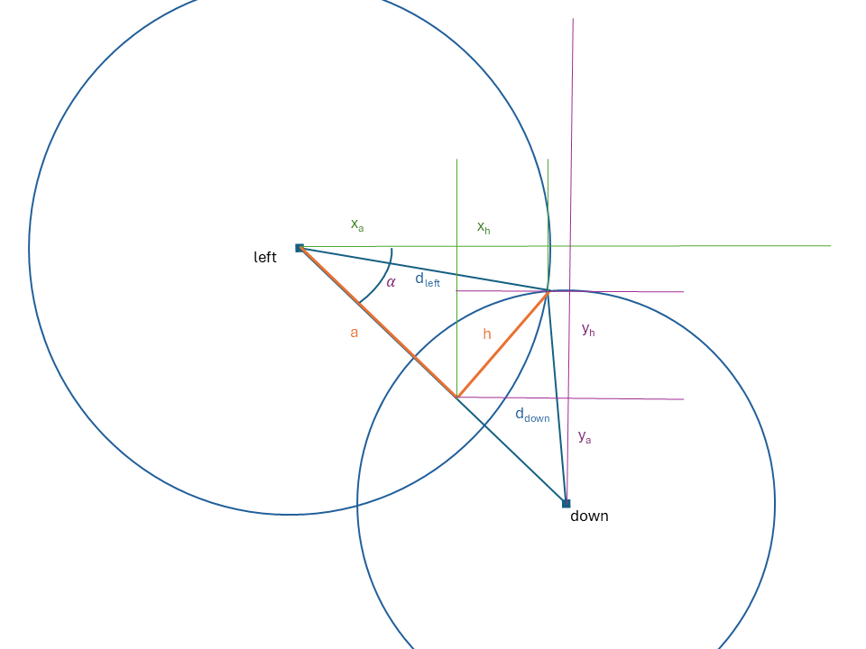

```{r setup, include=FALSE}
knitr::opts_chunk$set(echo = TRUE)
```

# Position des quadrats

## Fonction de triangulation


```{r}
#' echo: false

```

On connaît la position des points à gauche $(x_{left}, y_{left})$ et en dessous $(x_{down}, y_{down})$ du point à placer ("next"), ainsi que les distances entre eux et le point à placer: $d_{left}$ et $d_{down}$.

Par le théorème de Pythagore, on connaît:

- la distance entre les points de gauche et du bas:
$$d =  \sqrt{(x_{left} - x_{down})^2 + (y_{left} -y_{down})^2}$$
- deux équations reliant $a$ et $h$
\begin{align}
a^2 + h^2 &= d_{left}^2\\
(d - a)^2 + h^2 &= d_{down}^2
\end{align}


La première équation du système permet d'isoler $h$:
$$h^2 = d_{left}^2 - a^2$$
En substituant $h^2$ dans la deuxième équation:
$$(d - a)^2 + d_{left}^2 - a^2= d_{down}^2$$
d'où
$$a = \frac{d^2 + d_{left}^2 - d_{down}^2}{2d}$$
et
$$h = \sqrt{d_{left}^2 - a^2}$$

Les distances entre les points précédents et le point suivant sont calculées en projetant $a$ et $h$ sur les axes du repère. 
Pour cela, l'angle $\alpha$ est calculé:
$$\alpha = \arctan{\frac{x_{down} - x_{left}}{y_{left} - y_{down}}}$$

Il reste à projeter:

\begin{equation} 
\begin{split}
d_left & = x_a + x_h\\
 & = a \sin\alpha + h \cos\alpha
\end{split}
\end{equation}

et 

\begin{equation} 
\begin{split}
d_down & = y_a + y_h\\
 & = (d - a) \sin{(\frac{\pi}{2} - \alpha)} + h \sin\alpha
\end{split}
\end{equation}

La fonction `next_point()` calcule les coordonnées du point suivant:
```{r}
# Triangulation
next_point <- function(
    x_left,
    y_left,
    x_down,
    y_down,
    d_left,
    d_down) {
  # distance left-down
  d_squared <- (x_left - x_down)^2 + (y_left - y_down)^2
  d <- sqrt(d_squared)
  # distance left-height
  a <- (d_squared + d_left^2 - d_down^2) / 2 / d
  # height
  h <- sqrt(d_left^2 - a^2)
  # angle
  alpha <- atan((x_down - x_left) / (y_left - y_down))
  # next point
  d_left_a <- a * sin(alpha)
  d_left_h <- h * cos(alpha)
  d_down_a <- (d - a) * sin(pi / 2 - alpha)
  d_down_h <- h * sin(alpha)
  return(c(d_left_a + d_left_h, d_down_a + d_left_h))
}
```

Test de la fonction:
```{r}
# Test the function
x_left <- 0
y_left <- 10
x_down <- 10
y_down <- 0
d_left <- 11
d_down <- 10
next_point(x_left, y_left, x_down, y_down, d_left, d_down) 
```


## Placement des quadrats

Le tableau des mesures contient trois colonnes pour décrire la position des angles des quadrats: `plot` pour l'hectare, `point_x` et `point_y` pour le numéro du point, de (0, 0) pour le coin inférieur gauche à (10, 10) pour le coin supérieur droit.

Pour chaque point, la distance à son voisin de gauche (`y` identique) et du bas (`x` identique), mesurées sur le terrain, sont dans les colonnes `d_left` et `d_down`.

Le code suivant:

- lit le tableau des mesures et prépare deux colonnes supplémentaires, `x` et `y`, pour y placer les coordonnées à calculer,

```{r}
library("tidyverse")

# data
read_csv2("data/Piquets_Paracou13_18_23_24.csv") %>% 
  # Add columns for the correct coordinates
  mutate(x = 0, y = 0) -> the_quadrats
```

- ajoute les coins inférieurs gauche (0, 0),

```{r}
# Add points (0,0) to plots
for (plot_number in unique(the_quadrats$plot)) {
  the_quadrats %>% 
    add_row(
      plot = plot_number,
      point_x = 0,
      point_y = 0,
      x = 0,
      y = 0
    ) -> the_quadrats
}

```

- trie les données et transforme le tibble en dataframe pour que les extractions futures, comme `the_quadrats[i, "x"]`, soient des scalaires et non des tibbles,

```{r}
# Sort so that the next point can rely on previous ones
the_quadrats %>% 
  arrange(plot, point_x, point_y) %>% 
  as.data.frame() -> the_quadrats
```

- calcule les coordonnées des points situés sur les bords gauche et bas des hectares par simple cumul des distances mesurées depuis l'origine,

```{r}
# Deal with edges: cumulative sum of distances from the origin
for (plot_number in unique(the_quadrats$plot)) {
  is_left_edge <- 
    the_quadrats$plot == plot_number &
    the_quadrats$point_x == 0 &
    the_quadrats$point_y != 0
  the_quadrats[is_left_edge, "y"] <- cumsum(
    the_quadrats[is_left_edge, "d_down"]
  )
  is_down_edge <- 
    the_quadrats$plot == plot_number &
    the_quadrats$point_x != 0 &
    the_quadrats$point_y == 0
  the_quadrats[is_down_edge, "x"] <- cumsum(
    the_quadrats[is_down_edge, "d_left"]
  )
}
```

- calcule les coordonnées de tous les autres points par triangulation.

```{r}
# Compute the positions of the points
for (i in seq_len(nrow(the_quadrats))) {
  # Ignore the edges
  if (the_quadrats[i, "point_x"] != 0 & the_quadrats[i, "point_y"] != 0) {
    x_left = the_quadrats[
      the_quadrats$plot == the_quadrats[i, "plot"] &
        the_quadrats$point_x == max(the_quadrats[i, "point_x"] - 1, 0) &
        the_quadrats$point_y == the_quadrats[i, "point_y"],
      "x"
    ]
    y_left = the_quadrats[
      the_quadrats$plot == the_quadrats[i, "plot"] &
        the_quadrats$point_x == max(the_quadrats[i, "point_x"] - 1, 0) &
        the_quadrats$point_y == the_quadrats[i, "point_y"],
      "y"
    ]
    x_down = the_quadrats[
      the_quadrats$plot == the_quadrats[i, "plot"] &
        the_quadrats$point_x == the_quadrats[i, "point_x"] &
        the_quadrats$point_y == max(the_quadrats[i, "point_y"] - 1, 0),
      "x"
    ]
    y_down = the_quadrats[
      the_quadrats$plot == the_quadrats[i, "plot"] &
        the_quadrats$point_x == the_quadrats[i, "point_x"] &
```


```{r}
the_quadrats$point_y == max(the_quadrats[i, "point_y"] - 1, 0),
      "y"
    ]
    the_quadrats[i, c("x", "y")] <- 
      c(x_left, y_down) +
      next_point(
        x_left = x_left,
        y_left = y_left,
        x_down = x_down,
        y_down = y_down,
        d_left = the_quadrats[i, "d_left"],
        d_down = the_quadrats[i, "d_down"]
      )
  }
}
```

Le dataframe `the_quadrats` contient maintenant la position des quadrats.

Figure:
```{r}
the_quadrats %>% 
  ggplot(aes(x = x, y = y, color = as.factor(plot))) +
  geom_point() +
  scale_color_discrete() +
  scale_x_continuous(breaks = (0:10) * 10) +
  scale_y_continuous(breaks = (0:10) * 10) +
  coord_fixed() +
  labs(color = "Plot") +
  facet_grid(~ plot)
```


